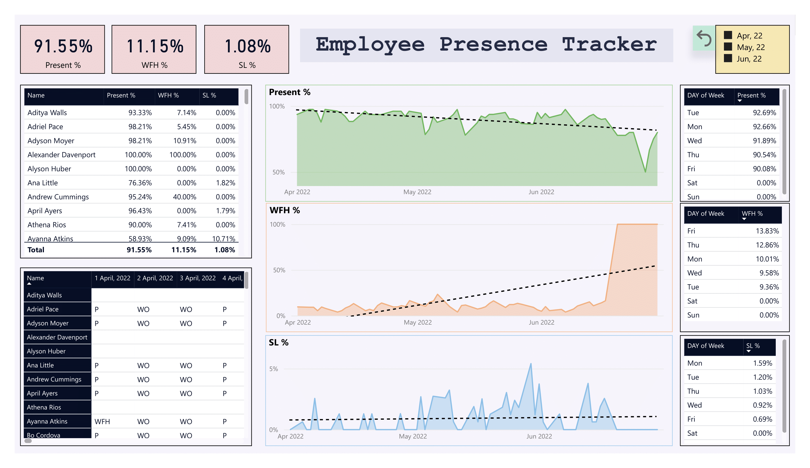

---

# Employee Presence Tracker Dashboard

## Project Overview
The **Employee Presence Tracker Dashboard** is a comprehensive tool built in Power BI that provides insights into employee attendance, remote working, and leave patterns. It visualizes key trends across months, days of the week, and individual employee metrics, enabling data-driven decisions to improve workplace efficiency and employee engagement.

---

## Dashboard Preview
### Dashboard

  
*Visual of employee attendance metrics, including present percentage, WFH percentage, and SL percentage.*

## Objective
To create a Power BI dashboard that provides actionable insights into employee attendance patterns, supporting HR teams in monitoring workplace presence, understanding remote work trends, and identifying potential areas of improvement.

---

## Key Metrics
1. **Present Percentage:** 91.55%  
2. **Work From Home (WFH) Percentage:** 11.15%  
3. **Sick Leave (SL) Percentage:** 1.08%  

---

## Key Insights
1. **Monthly Attendance Trends:**
   - April 2022 saw the highest attendance, while May and June exhibited slight declines in **Present %**.  

2. **Day of the Week Trends:**
   - **Tuesday** and **Monday** have the highest presence rates at over 92%.
   - **Friday** exhibits the highest **WFH %** (13.83%), followed by **Thursday** (12.86%).  

3. **Employee Performance:**
   - Top performers include employees like **Adriel Pace** (98.21% presence) and **Andrew Cummings** (95.24% presence).  
   - Areas of concern include employees with high absence rates, such as **Ayanna Atkins** (58.93% presence).  

4. **Remote Work Patterns:**
   - WFH is utilized most on Fridays and Thursdays, suggesting flexible policies.  

5. **Sick Leave Trends:**
   - Mondays see the highest **SL %** (1.59%), indicating potential patterns of absenteeism.

---

## Project Structure
1. **Data Sources:**
   - Attendance records across multiple employees, containing fields like dates, names, and presence status (P, WFH, SL, WO).

2. **ETL Process:**
   - Data was cleaned and structured using Power Query in Power BI.  
   - Calculated fields like **Present %**, **WFH %**, and **SL %** were derived.

3. **Dashboard Features:**
   - **Overview Metrics:** Aggregate statistics on attendance, WFH, and SL.  
   - **Employee Comparison:** Detailed table comparing individual metrics.  
   - **Time-Based Trends:** Charts displaying attendance trends by months and days.  

4. **Interactivity:**
   - Filters by date, employee name, and presence type allow dynamic analysis.

---

## Outcomes
- **Enhanced Attendance Monitoring:** HR teams can quickly identify attendance patterns and focus on areas requiring improvement.  
- **Improved Flexibility Analysis:** Insights into WFH and SL trends help shape remote work policies.  
- **Data-Driven Decision Making:** Comprehensive metrics enable better workforce management and policy adjustments.  

---
## Developed By

**Abhimanyu Kumar**
**Date**: 20-01-2025
[LinkedIn Profile](https://www.linkedin.com/in/abhimanyu7870/)

---

Thank you for reviewing the Employee Presence Tracker Dashboard!